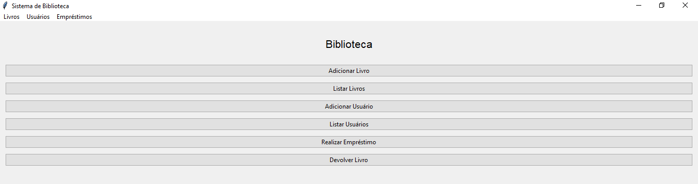

# Sistema de Biblioteca com Tkinter e JSON

Um sistema completo para gerenciamento de bibliotecas com interface gráfica moderna, desenvolvido em Python com Tkinter e armazenamento persistente em JSON.

## Recursos Principais

- 📚 **Gerenciamento de Livros**
  - Adicionar novos livros (título e autor)
  - Listar todos os livros cadastrados
  - Visualização detalhada em tabelas organizadas
  - Visualizar status (disponível/emprestado)

- 👥 **Gerenciamento de Usuários**
  - Cadastrar novos usuários
  - Listar organizada com ordenação por nome ou ID

- 🔄 **Controle de Empréstimos**
  - Realizar empréstimos de livros
  - Registrar devoluções
  - Visualizar livros emprestados no momento

- 💾 **Persistência de Dados em JSON**
  - Todos os dados são salvos automaticamente em arquivo JSON
  - Estrutura organizada por entidades (livros, usuários, empréstimos)
  - Leitura e escrita eficiente com módulo json padrão do Python

## Tecnologias Utilizadas

- Python 3.12.8
- Tkinter (interface gráfica)
- Módulo JSON (armazenamento de dados)

## Autores

- [@beatrizdantasp](https://github.com/beatrizdantasp)

- [@acllaras](https://github.com/acllaras)
